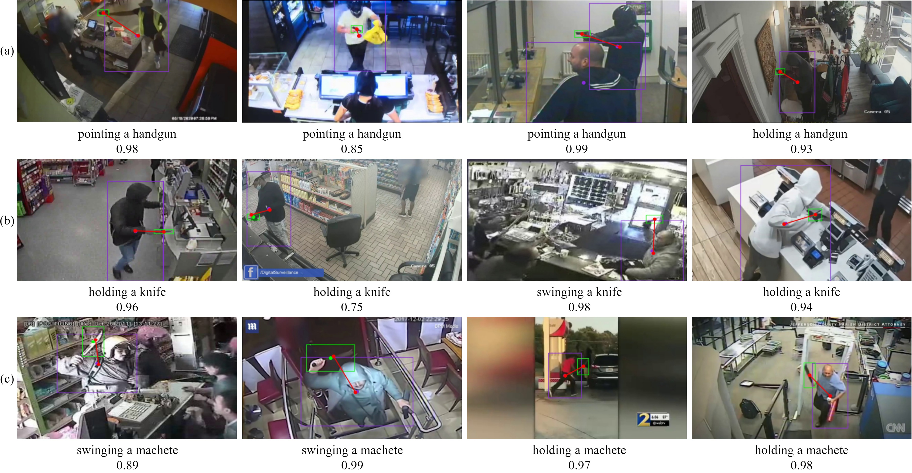

# GitHub repository for AVSS Paper ID 77: Reimagining Violent Action Detection with Human-Object Interaction

Abstract: The rising urban crime rates globally underscore the need for advanced video surveillance systems capable of autonomously detecting violent actions. Current deep learning models face limitations, struggling with subtle motions and lacking real-time capabilities. In response, we advocate for a paradigm shift in surveillanceoriented violent action detection, emphasizing the pivotal role of human-object interaction (HOI) detection as opposed to conventional action recognition methodologies. Our contributions include unveiling Violence-HOI (V-HOI), a dataset capturing HOI interactions in static surveillance images. Additionally, we introduce Violence-Net (VNet), a novel convolutional-transformer network architecture, which outperforms existing HOI approaches by 5.25 percentage points in mean average precision. Moreover, when trained on V-HOI, V-Net achieves near real-time processing at 10.43 frames per second, demonstrating its practicality in dynamic surveillance scenarios.

Dataset links will be added in soon!
